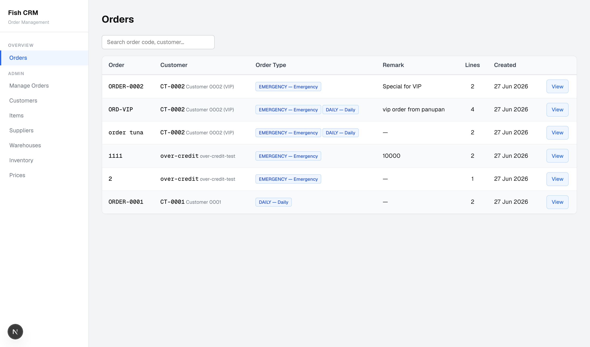
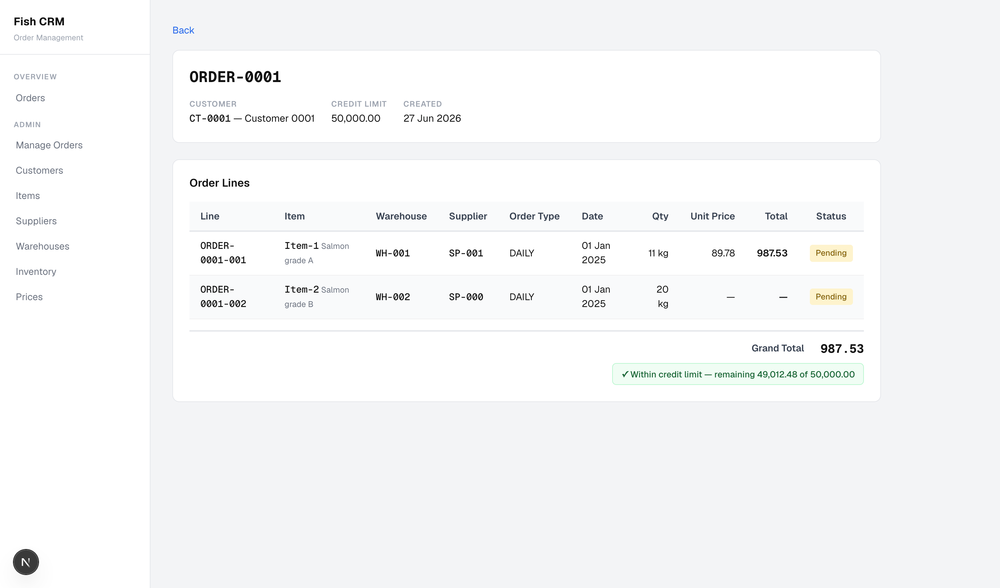
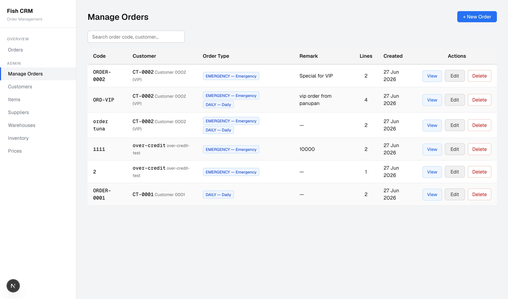
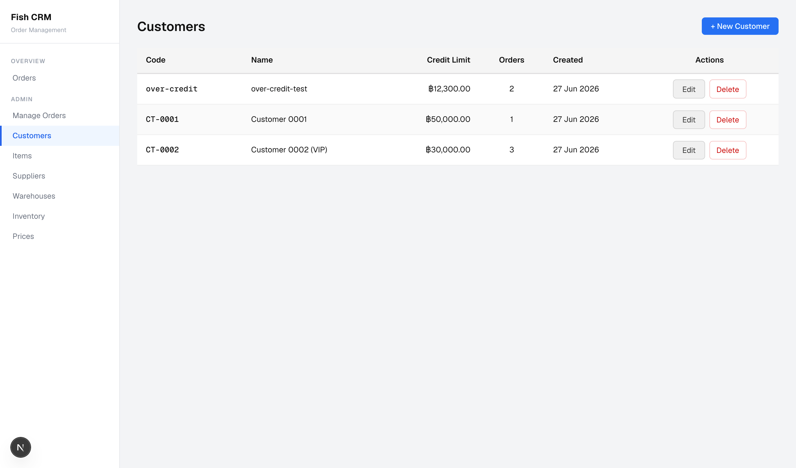
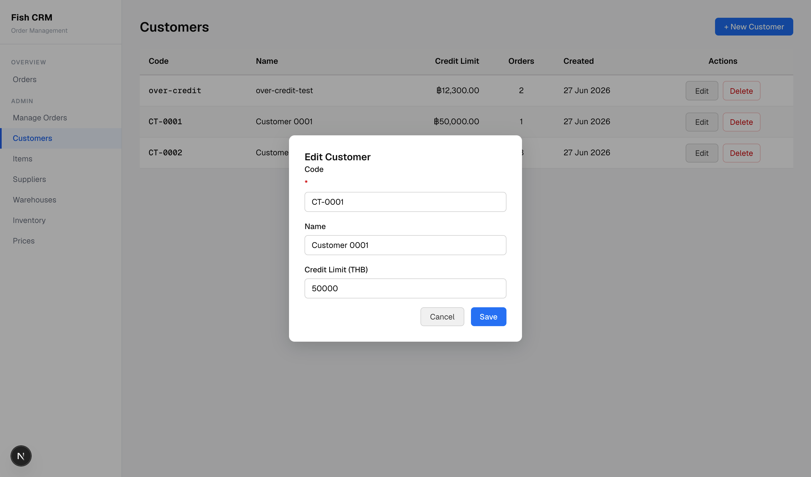
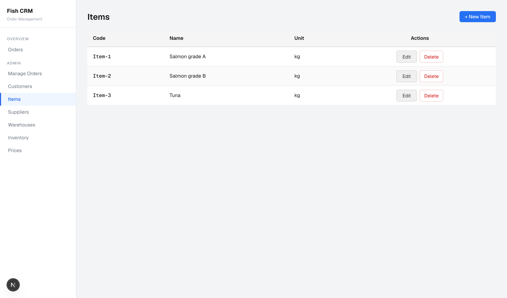
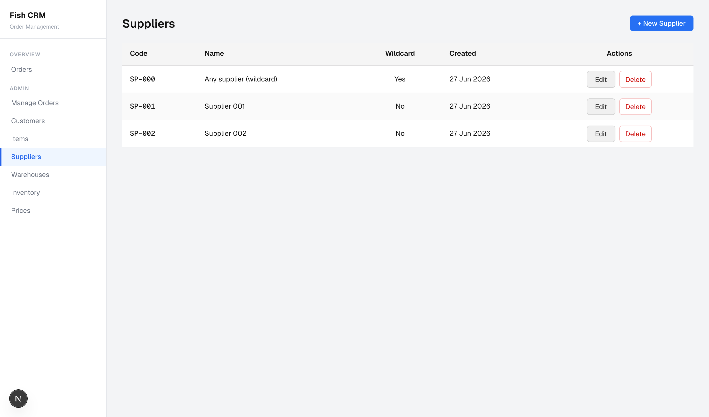
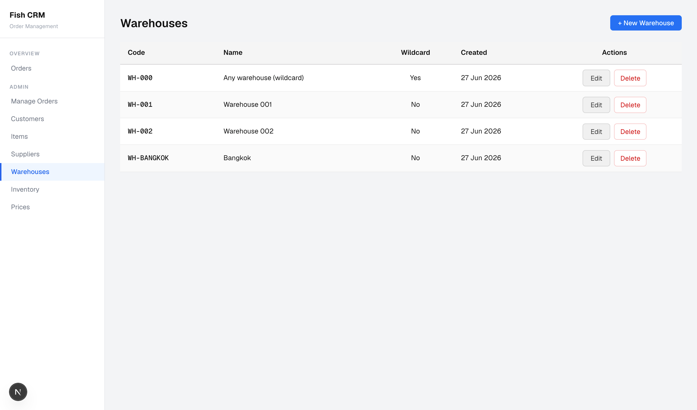
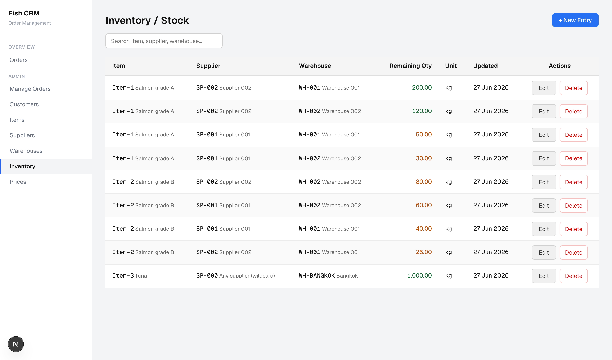
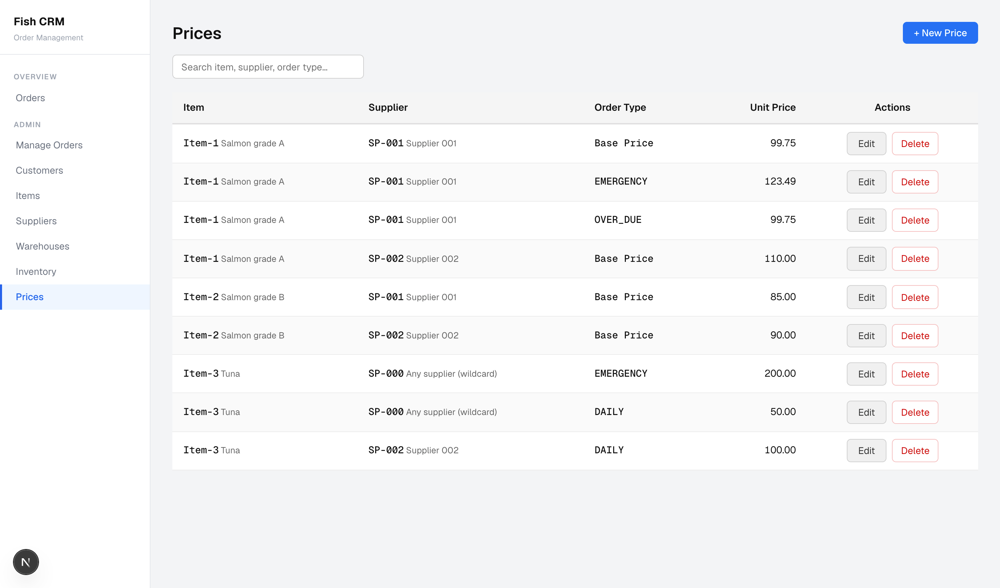

# Fish CRM — Order Management

A full-stack CRM for managing fish (salmon/tuna) purchase orders, customer credit limits, inventory stock, supplier pricing tiers, and automatic allocation.

## Tech Stack

| Layer | Technology |
|---|---|
| Frontend | Next.js (TypeScript, App Router) |
| Backend | NestJS + Prisma ORM |
| Database | PostgreSQL 16 |
| Container | Docker Compose |

## Features

### Orders Overview
Browse all orders at a glance — search by order code or customer, see order type badges (EMERGENCY / DAILY), line count, and creation date.



### Order Detail
Drill into an order to see every line item with its warehouse, supplier, order type, quantity, unit price, and total. A credit-limit indicator shows remaining headroom or flags an over-limit order.



### Manage Orders
Create, edit, and delete orders with full sub-order (line) management. The create form validates against the customer's credit limit in real time.



### Customers
Manage customers with credit limits (THB). Each row shows total order count for quick reference.





### Items
Catalogue of fish products (Salmon grade A/B/C, Tuna, etc.) with unit of measure.



### Suppliers
Suppliers support a **wildcard** flag (`SP-000 — Any supplier`). When a sub-order uses the wildcard, the allocation engine picks the best available supplier automatically.



### Warehouses
Same wildcard pattern for warehouses (`WH-000 — Any warehouse`).



### Inventory / Stock
Track remaining stock per item × supplier × warehouse combination. Quantities are highlighted for quick scanning.



### Prices
Price tiers per item × supplier: **Base Price**, **EMERGENCY** (125%), **OVER\_DUE** (100%), and **DAILY** (90%). Explicit overrides take precedence over the percentage-based calculation.



## Project Structure

```
fish-order-crm/
├── frontend/          # Next.js app  (port 3000)
├── backend/           # NestJS API   (port 3001)
├── db/
│   └── init/
│       ├── 01_schema.sql          # DDL — tables & indexes
│       ├── 02_seed.sql            # Base sample data
│       └── 03_seed_extended.sql   # Extended mockup data
├── docker-compose.yml
└── ex-images/         # UI screenshots
```

## Getting Started

### Prerequisites
- Docker & Docker Compose

### 1. Configure environment

Create a `.env` file in the project root:

```env
POSTGRES_USER=postgres
POSTGRES_PASSWORD=postgres
POSTGRES_DB=fish_crm
```

### 2. Start all services

```bash
docker compose up --build
```

This starts three services in order:

| Service | URL |
|---|---|
| Frontend | http://localhost:3000 |
| Backend API | http://localhost:3001 |
| PostgreSQL | localhost:5432 |

The database is initialised automatically from `db/init/` on first run — schema, seed data, and extended mockup data are all applied.

### 3. Open the app

Navigate to **http://localhost:3000**.

## Data Model

```
customers ──< orders ──< sub_orders ──< allocations
                              │
              items ──────────┤
           suppliers ─────────┤
          warehouses ─────────┘
               │
           inventory (supplier × warehouse × item → remaining_quantity)
           prices    (item × supplier × order_type → unit_price)
          order_types (EMERGENCY / OVER_DUE / DAILY — priority & %)
```

### Order Type Price Tiers

| Code | Priority | Multiplier |
|---|---|---|
| EMERGENCY | 1 | 125% |
| OVER_DUE | 2 | 100% |
| DAILY | 3 | 90% |

An explicit price row for a given `(item, supplier, order_type)` overrides the base-price × percentage calculation.

### Wildcard Resolution

`SP-000` (any supplier) and `WH-000` (any warehouse) are wildcard records. The allocation engine resolves them by selecting the inventory row with the highest `remaining_quantity` that matches the non-wildcard dimension.
